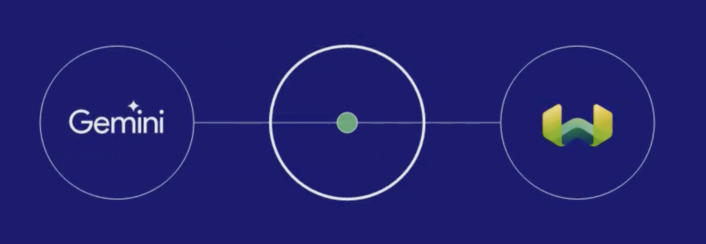

# 🧗‍♀️ Benchmark Climbing FAQ Bot
This script is a simple FAQ bot for Benchmark Climbing, a rock climbing gym. It uses Google's Generative AI to answer questions based on a predefined context. The context currently includes a list of FAQs about Benchmark Climbing, pulled from their website.


## How it works
The script first loads an API key for Google's Generative AI from an environment variable. It then sets up the generative model and defines the context for the bot. The context is a series of questions and answers about Benchmark Climbing.

The script then enters a loop where it waits for user input, generates a response using the generative model, and prints the response.

## Extensibility
This script is easily extensible to include information beyond the rock climbing gym FAQ. To do this, you would simply need to extend the context variable with additional questions and answers. The generative model will then be able to use this additional information when generating responses.

For example, you could add information about other activities offered by the gym, details about membership pricing, or information about upcoming events. As long as the information is formatted as a series of questions and answers, the bot should be able to use it to generate responses.



Additionaly, you can use Weaviate's Generative Search Module that integrates directly with models on Google including Gemini. 

Learn more abou that [here](https://weaviate.io/developers/weaviate/modules/reader-generator-modules/generative-palm). 

## Setup
To run this script, you will need to have Python installed and you will need to install the google-generativeai and python-dotenv packages. You can install these packages using pip:

```pip install google-generativeai python-dotenv```

You will also need to set up a .env file in the same directory as the script, with the following content:

```GEMINI_API_KEY=your_api_key_here```

Replace your_api_key_here with your actual API key for Google's Generative AI.

Once you have done this, you can run the script using Python:

```python main.py```

Usage
To use the bot, simply type your question at the prompt and press enter. The bot will generate a response and print it. To ask another question, just type it at the next prompt!